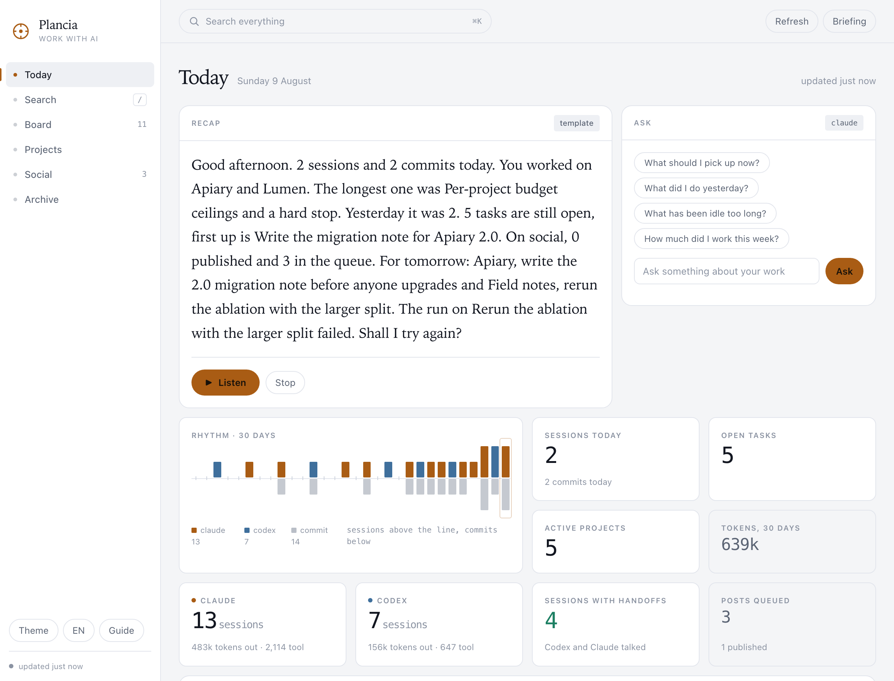
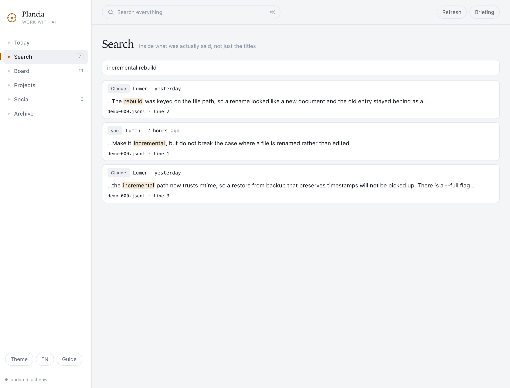
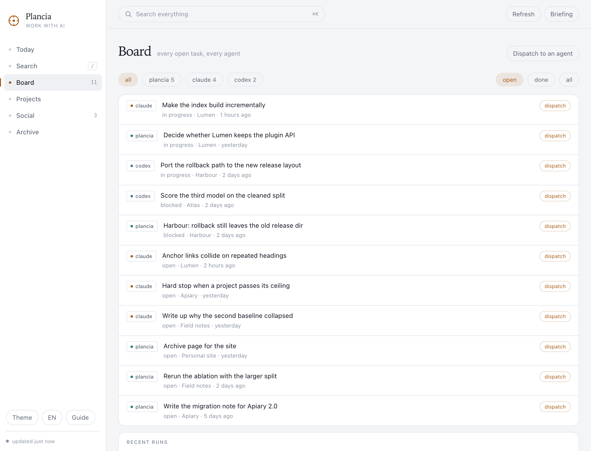
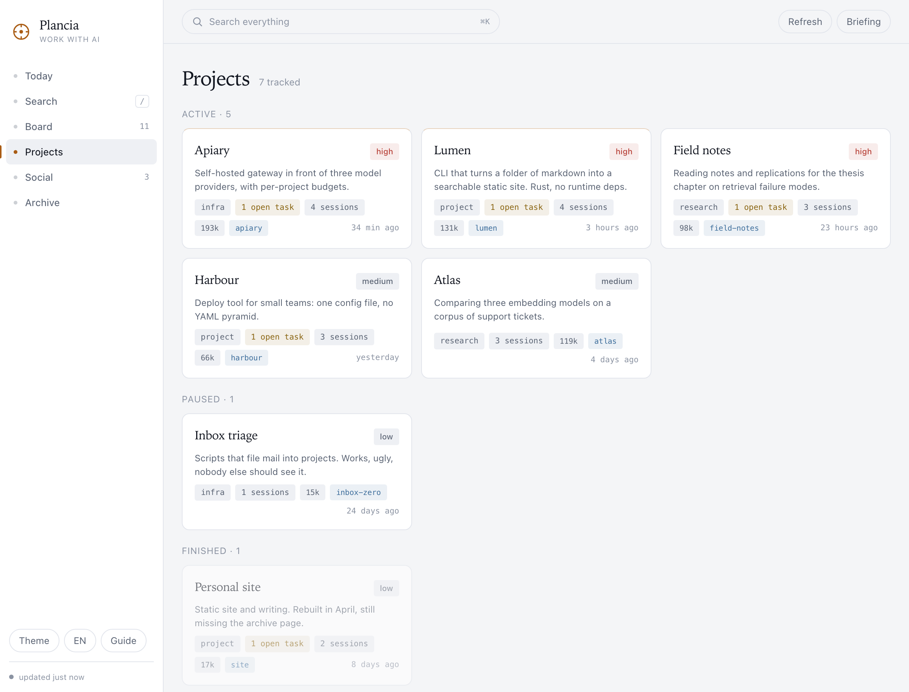

# Plancia

[](https://github.com/nerln/plancia/actions/workflows/prova.yml)

Claude Code and Codex already write down everything they do, in files on your
disk. Nothing reads them together. Plancia does: one row per project tells
you what to do next, Resume reopens the conversation that wrote the task, and
a spoken recap of the day closes with what is worth doing. The rest stays
folded, one click away.

Website: [plancia](https://nerln.github.io/plancia/).

Local-first: no telemetry, no account, no server of ours. The only thing that
goes out is the work you explicitly hand to an agent, and it goes through the
`claude` or `codex` command already on your machine, under your own
subscription. No dependencies to install: Python 3 and its standard library,
Swift for the app.

[Italiano](README.it.md)



## What it reads

| source | where | what it gets |
|---|---|---|
| Claude Code sessions | `~/.claude/projects/**/*.jsonl` | date, project, opening prompt, turns, tools, tokens |
| Claude memory | `~/.claude/projects/*/memory/*.md` | project descriptions, `[[wiki]]` links |
| skills, plugins, routines | `~/.claude/skills`, `plugins`, `scheduled-tasks` | what your Claude Code can do |
| GitHub | `gh repo list`, recent commits | repos, commits, real material for posts |
| local git | your code roots | branch, uncommitted changes |
| Codex sessions and goals | `~/.codex/sessions`, `goals_1.sqlite` | the same, plus what Codex is stuck on |
| Claude Code task lists | `~/.claude/tasks/<session>/*.json` | what is open right now, per session |
| session hooks | `SessionStart`, `SessionEnd` | which sessions are open right now |

Sources are never modified. Plancia reads them and stays out of the way.

See [docs/NOVITA.md](docs/NOVITA.md) for what changed recently and why.

## Install

```bash
git clone https://github.com/nerln/plancia.git ~/dev/plancia
cd ~/dev/plancia
./bin/plancia install      # command, MCP server, hooks, skills, autostart
./bin/plancia init         # builds your project map from repos, folders, memory
./mac/build.sh --install   # builds Plancia.app into /Applications
```

`plancia uninstall` puts everything back. Your data stays in `~/.plancia/`.

## Windows and Linux

macOS comes first: that is where the native app lives. The rest of Plancia is
Python and a local web server, so it also runs on Windows and Linux, with the
dashboard in your browser. You need Python 3.9+ and Claude Code or Codex.

Windows (PowerShell):

```powershell
git clone https://github.com/nerln/plancia.git $HOME/plancia
cd $HOME/plancia
python bin/plancia install       # command, MCP server, hooks, skills, autostart
python bin/plancia init          # builds your project map
python bin/plancia serve --open  # the dashboard, in your browser
```

Linux:

```bash
git clone https://github.com/nerln/plancia.git ~/dev/plancia
cd ~/dev/plancia
python3 bin/plancia install
python3 bin/plancia init
python3 bin/plancia serve --open
```

`install` also writes a `plancia` command. On Windows it is a `plancia.cmd` shim
in `%LOCALAPPDATA%\Plancia\bin`, and it tells you to add that folder to your PATH
if it is not there yet; `bin/plancia.cmd` does the same job from inside a clone.
On Linux it is a link in `~/.local/bin`. `plancia uninstall` puts everything back.
If `python` is not on your PATH (the python.org installer does not add it by
default, and `python` can be the Microsoft Store stub), use `py -3 bin/plancia
install` instead. `pip install` is not a supported route yet: the package does not carry the
dashboard files or the `bin/` scripts, so use the clone.

What works the same: the dashboard, the `plancia_*` MCP tools in Claude Code and
Codex, the session hooks and the memory recall, the skills, search, the recap,
Resume (it opens a terminal in the right folder), and starting the server at every
login.

What each system uses underneath:

| | macOS | Windows | Linux |
|---|---|---|---|
| start at login, daily recap | launchd | Task Scheduler, or the Startup folder if that is refused | systemd `--user`, or `~/.config/autostart` |
| Resume opens | Terminal | Windows Terminal, else a new console window | the first of x-terminal-emulator, gnome-terminal, konsole, xterm |
| clipboard | `pbcopy` | `clip` | wl-copy, xclip or xsel |
| spoken recap | `say` | the built-in speech synthesizer | espeak-ng (or espeak) and an audio player |
| notification | `osascript` | PowerShell balloon | `notify-send`, if installed |

On Windows and Linux there is no native app: open http://127.0.0.1:7773 in Chrome
or Edge and choose Install Plancia. It gets its own window and icon, and it still
opens with the server off, showing the last state it saw. Safari on macOS does the
same with Add to Dock.

What does not exist outside macOS: the native app, its menu bar item, the
`plancia://` URL actions and the hands-free voice panel. `plancia jarvis "..."`
from a terminal still works. If a piece is missing on your machine the rest
carries on: no notification tool means no notification, and no clipboard tool
means nothing is copied. With no speech engine, `plancia say`, `plancia voice
prova`, `plancia recap --speak`, `plancia ask --speak` and `plancia jarvis --speak`
say so and what to install, the MCP `speak`
action answers `letto: false` with the reason, and `plancia doctor` reports the
voice as missing. The dashboard keeps working too: the recap, "Ask" and Jarvis
answer with the text and a `voce: null` field plus a `nota_voce` explaining that
there is no speech engine, and only the playback is skipped ("Listen" shows
that note instead of a generic error). Outside macOS the voice engine is reported by
its real name (`System.Speech`, `espeak-ng`) and the voice list comes from it. On Windows,
Resume needs Windows Terminal for a lost task when `claude` is a `.cmd` file (an
npm install): its multi-line prompt cannot be handed to `cmd.exe` safely, and
Resume says so instead of opening a broken command. On Windows the server starts at login but is not restarted after a crash, and
its errors are not logged (launchd on macOS and systemd on Linux do restart it).
A second `plancia serve` while the login one is running says so (and with `--open`
opens the browser on it) instead of failing on the busy port. `plancia esporta --apri`
opens the file with the system's own opener (`open -R`, `os.startfile`, `xdg-open`).
Folders that hold projects without being one (an external disk, another projects
folder) go in `config.json` under `contenitori`, a list of paths, next to the ones
Plancia recognises by itself (`~/dev`, `~/Siti`, the Google Drive folders). On macOS
that includes the disks you used to add by hand: an external disk is a container
only if it is listed there (`"contenitori": ["/Volumes/Disco/dev"]`), and
`plancia doctor` prints the containers in use. Start at login and the daily recap
never load launchd, Task Scheduler or systemd jobs from a throwaway environment: if
the process `HOME` is not the user's real home (or `PLANCIA_HOME` points outside it)
the files are written but not loaded ("file scritti, non caricati (HOME di prova)").
`PLANCIA_AUTOSTART_FORZA=1` forces the commands, for a machine where they are stubs.
The commands Plancia builds for each system are covered by the suite, but Windows and
Linux have had far less real use than macOS: `plancia doctor` tells you what is
connected.

## The three ways in

**The app.** A native window, a menu bar item, and the voice. It supervises the
backend, so there is nothing to start by hand. `plancia://recap`,
`plancia://jarvis`, `plancia://ask?q=…`, `plancia://open?view=projects` and
`plancia://pdf` are
URL actions you can bind to a system shortcut, Raycast or Shortcuts.

**Claude Code and Codex.** Seven `plancia_*` MCP tools in every session of both, a
`SessionStart` hook that hands Claude your current state as opening context, and
two skills that tell it when to read from Plancia and when to write back. Seven
and not twenty: the six that get used stay exposed, the rest sit behind one
`plancia` tool you call with `azione`. Tool schemas are paid for in every single
request of a session, so the surface is the bill. Measured: 1195 tokens per
Claude Code session and 1020 per Codex session, down from 2870 and 2196.

**The terminal.** `plancia recap --speak`, `plancia ask "what did I ship this
week?"`, `plancia task add`, `plancia cerca "a phrase you remember"`,
`plancia projects`.

## Search: inside what was said

Transcripts are the largest thing you own and the hardest to get back into. A
session title tells you nothing six weeks later; the sentence you are trying to
find is somewhere in the middle of a conversation.

Plancia keeps an FTS5 index over the prose of every turn, yours and the agent's,
from Claude Code and Codex. Tool results stay out on purpose: they are most of
the bytes and almost never the thing you remember. On this machine that is 13,000
turns from 1,287 transcripts, 20 MB indexed out of 979 MB on disk, rebuilt from
scratch in 5 seconds and kept current incrementally, which costs one `stat` per
unchanged file.

Every hit comes back verbatim with the file and the line it came from, so you
reopen the moment instead of reading a summary of it.



```bash
plancia cerca "the blending denominator"
plancia cerca "cookies" --project molo
```

In the dashboard, `/` opens search from any view; chips above the results count
the hits per project across the whole index, not just the page. In Claude Code
and Codex it is `plancia_search`.

## What a session actually worked on

A session used to land in the project of the folder it was opened from. That
works for Codex, which is opened inside the project. It does not work for Claude
Code: measured on this machine, 199 sessions out of 587 were opened from the
Drive root, from `~/dev` or from the home folder, places you work on everything
from.

Plancia now also looks at what the session touched: the files in its `tool_use`
blocks and the absolute paths inside Bash commands, counted per project folder.
If the folder it was opened from says nothing, the most touched folder wins; if
that folder is already a project, it is kept unless 70 percent of the paths are
somewhere else. Every row carries the inferred folder and the reason, so the
attribution can be checked instead of trusted.

```bash
plancia sessioni                         # the catalogue, by project
plancia sessioni --progetto molo --giorni 30
plancia sync --riattribuisci             # recompute the whole archive
```

A tilde at the end of a row, and the "inferred from paths" note in the
dashboard, mark the sessions attributed this way. Plancia's own internal calls
and throwaway sessions stay out of the way: `--tutte` shows them.

## The daily recap

Plancia collects the day from real data, sessions and commits and tasks opened
and closed and posts and what each project is waiting on, and turns it into something
written to be heard: short sentences, no lists, no markdown, no file paths read
out loud.

Two engines for the text. The template one is deterministic, costs nothing and
always works. The other passes the same data to Claude Code in headless mode
(`claude -p`) and gets a better told version in about eight seconds. If Claude
does not answer in time, the template takes over and you never notice.

Two engines for the voice. [Voicebox](https://github.com/jamiepine/voicebox) if
its local backend is up, so you get your own cloned voice. Otherwise the macOS
system voices, which are always there, need no setup and start instantly. Both
handle Italian, English, Spanish, French, German and Portuguese.

```bash
plancia recap --speak            # today, out loud
plancia recap --lang en          # in English
plancia ask "where did I leave the transcription pipeline?" --speak
plancia daily on 08:45           # every morning, as a notification
plancia daily on 08:45 --voce    # every morning, out loud
```

Asking a question goes through Claude Code with your Plancia context attached, so
the answer is grounded in what actually happened, not in a guess.

### It ends with a decision

The recap does not stop at the facts. Plancia looks for signals in the data and
turns them into proposals, each with an action already prepared: a failed run to
retry, a Codex goal out of quota, files uncommitted since yesterday, an approved
post that never went out, a project whose declared next step has gone stale.
Proposals only ever come from signals, never from a model's hunch, so a quiet day
gives you a short recap instead of an invented suggestion. Say "do it", or "the
second one", and it runs.

## Next up

One row per active project, on Today, next to the recap: its first open task,
or its declared next step when nothing is open, grouped by area, sorted by
deadline and then by last activity. Up to seven rows show per group; the rest
sit behind an "N more". It needs the area map from `plancia riordina` to
group by anything but a flat list.

## Jarvis

Hold nothing, press nothing. `⌥Space` anywhere, or `plancia://jarvis`, opens a
panel that listens continuously and works out you have finished speaking from the
silence, not from a key you keep held down.

What it hears goes two ways. Phrases it can recognise with certainty (open a
view, note a task, close one, re-read the sources, read me the recap) run
locally in a tenth of a second. Everything else goes to Claude Code in headless
mode with the `plancia_*` tools open, so it can actually add the task, update the
project or search the archive, not just answer about it.

There is a text field at the bottom of the panel: it covers the case where the
microphone is unavailable, and lets you correct a misheard sentence by typing
instead of repeating it.

The microphone stays open while it answers, so you can cut it off by simply
speaking again. Echo cancellation on the input node is what makes that possible:
without it, it hears its own voice and interrupts itself. Say "cancel" to stop a
running dispatch, "stop" to close the panel. When a dispatched run finishes it
tells you out loud, even if you have moved on to something else.

```bash
plancia jarvis "remind me to write the migration note"   # same thing, typed
```

Claude Code has had [voice input since March 2026](https://claudefa.st/blog/guide/mechanics/voice-mode):
you hold the spacebar and dictate. It is input only, and by design there is no
hands-free mode. This is the other half: it speaks back, and it acts.

## All tasks



Claude Code keeps its task list in one folder, Codex keeps its goals in a
different database, Plancia has its own. None of the three knows the other two
exist. This view reads all of them, normalises the states to `open`, `in
progress`, `blocked`, `done`, `gone`, and shows one list.

**Resume is the first thing a row offers.** A task carries the id of the
session that wrote it, so the button on its row does not relaunch anything
from scratch: it reopens the actual conversation, in one of three states.
Alive, and Resume copies to the clipboard the message to paste into the
conversation that is already running (`resume task 42 of Plancia: <title>`):
there is nothing to launch. Closed, and pressing Resume opens a visible
Terminal on its own, running `claude --resume <id>` (or `codex resume <id>`)
in the task's own folder; Plancia never touches a transcript from a second
process. Lost, because the session was never recorded or has expired, and
then it says so instead of pretending, and starting over, with the context
written by hand, is the only option left.

```bash
plancia lavagna                          # every open task, in the terminal
plancia riprendi 42                      # resume task 42, in its own state
plancia riprendi 42 --apri               # do it now, exactly what the button does
plancia lanci                            # how a background dispatch went
```

Sending work off in the background is the other, secondary path, for when
resuming is not what you want: `plancia riprendi 42 --background --scrive
--istruzioni "rerun the ablation"` runs it unattended, on that task's own
session, and records the outcome. The default is read-only; `--scrive` lets
the agent write, and that is a choice you make every time. `plancia manda
"rerun the ablation" --agente codex --progetto atlas` is the older alias for
the same thing without a task id: it still works but prints a deprecation
warning on stderr and is going away in a future release. Inside Claude Code
and Codex, the same resume lives behind the `plancia` tool with
`azione="riprendi"` and the task's `id`.

## The event log

Other tools should not have to poll a database to know something happened. Every
meaningful event is appended to `~/.plancia/eventi.jsonl`, one JSON line, schema
`plancia.evento/1`:

```json
{"schema":"plancia.evento/1","id":"9f2c…","ts":"2026-08-02T09:14:22Z",
 "tipo":"lavoro.completato","titolo":"Rerun the ablation","progetto":"atlas",
 "origine":"cantiere","dati":{"agente":"codex","modo":"esegui","token":22800}}
```

Types: `lavoro.avviato|completato|fallito`, `task.creato|chiuso`,
`post.pubblicato`, `progetto.archiviato|aggiornato`, `riepilogo.pronto`. A
consumer keeps the id of the last event it saw and asks for what came after, with
`plancia eventi --dopo <id>` or `GET /api/eventi`. The file is append only and
rotates at 5 MB.

## Two agents, one archive

Plancia reads Codex sessions from `~/.codex/sessions` alongside Claude Code's,
and registers its own MCP server inside `~/.codex/config.toml`. Both agents see
the same projects, the same tasks, the same tools. The Agents view shows
who worked on what and when the two handed work to each other, inside the
Archive.

## Where the time goes

Every `claude -p` costs about five seconds of startup before it even thinks. In a
spoken conversation that is five seconds of silence per question. Plancia takes
three routes, in this order:

| route | when | cost |
|---|---|---|
| commands | open a view, note a task, close one, archive a project | 0.1 s |
| data answers | how many tasks, what should I pick up, how much did I work | 0.1 s |
| Claude, kept warm | anything else, with the `plancia_*` tools open | 2.7 s |

The Claude process stays alive between questions instead of being restarted, so
only the first one pays the startup, and the panel warms it up the moment you
open it. The daily recap is precomputed at the end of every cold pass: asking for
it costs 20 ms instead of ten seconds.

`bin/plancia-hook --prova` prints what it would hand to Claude without queueing
anything: testing the hook must not leave a session in the archive that never
happened.

## The data flow

```
sources ──▶ sync ──▶ SQLite ──▶ briefing.md · recap · REST · voice
```

Two rhythms, because reading twenty repos to find out you just opened a session
is a waste:

- **hot**, every two minutes, ~40 ms: the hook queue and the new tail of the
  transcripts. What you are doing right now.
- **cold**, every thirty minutes, ~1.5 s: memory, skills, repos, local git,
  project housekeeping, both search indexes, recap.

The cold pass used to take 40 seconds, and 20 of those were one folder. `git
status` inside a cloud-synced folder has to check every tracked file with the
file provider: measured cold on a 681 file repo, 2 minutes 51 seconds, against
10 ms for a repo on disk. Folders are now read eight at a time, a folder that
does not answer within four seconds is remembered and left alone for six hours,
and a status that never arrived is stored as unknown rather than as clean.

`plancia flusso` prints every source, where it comes from, which pass reads it
and how fresh it is.

## Projects end

A project born from a folder you worked in once, three weeks ago, is not an
active project: it is a memory. Plancia archives it on its own after two weeks
if it has no repo, no memory note and fewer than three sessions. Anything you
declared yourself is never touched. By voice: "archive the video project", or
"the Ard footage is finished".


## Projects



A project is whatever you say it is: a GitHub repo, a folder, a memory note, or
all three. `plancia init` proposes a map from what it finds; you correct it in
`~/.plancia/seed.json`. Sessions that run from a generic folder get attributed by
keyword, and re-attributed on every sync as you refine the keywords.

## Areas

A project map is only useful if it can be corrected, and correcting 122
projects one at a time never happens. `plancia riordina --proponi` computes a
map of parents for every project (an area like a thesis, or a real repo with
its worktrees) and writes it to a file instead of the database, so you can
read it before anything changes.

```bash
plancia riordina --proponi                    # writes the proposed map to a file
plancia riordina --mostra <file>              # prints it as a table
plancia riordina --applica <file>             # assigns every parent in it
plancia riordina --annulla <batch>            # undoes exactly that application
```

Applying is one batch, and undoing it restores each project's previous parent,
not just a blank one. Today (the recap view) and Next up group projects by
area once this map exists; before it does, they fall back to one flat list, so
nothing breaks for a fresh install.

## Compartments

Two groups of work on the same machine that must not see each other: a project
shared with someone else, and the rest. `compartimenti` in
`~/.plancia/config.json` names one or more compartments (each with its
`cartelle` and `sessioni`); everything else is the default one. Without it
Plancia does what it always did.

With it, every object gets a compartment from the data it already has: a session
from its id, its folder and its transcript; a task from the session that made it,
or from its project; a project from its paths and the memory notes linked to it;
a memory note from the file it lives in (Claude Code's automatic memory of a
folder belongs to that folder's compartment). Then each surface shows only its
own. The session briefing and the recall of notes "written in other folders"
leave the other compartments out. The MCP server filters what it reads, and a
write on another compartment's project, task or post is refused with a plain
message. The dashboard is your view, not an agent's, so it shows everything but
separated: a selector at the top picks the compartment (the default one first),
every view follows it, and what you create there belongs there.
`?compartimento=name` in the address opens it on one.

A session with signs of two compartments sees nothing. This decides what Plancia
shows; it is not a security boundary, same user and same disk.

The `plancia` command in a terminal works out its compartment the way the MCP
server does, from `CLAUDE_CODE_SESSION_ID` and the current folder: a command run
from a session of a named compartment sees that compartment only (board, events,
runs, briefing, search, sessions, recap, ask, jarvis, export, and the rest), and
a write on another compartment's project or task is refused. A human terminal
with no session id and a current folder outside every named compartment is the
default one and sees the default one; inside a named compartment's folder it
sees that one. The dashboard's voice assistant works from the compartment picked
in the selector, and from a named compartment a free-form question is answered
with that compartment's data in the prompt, not by the warm process with the
Plancia tools. A run started from a compartment belongs to it, even when its
project has no folder. Commands that administer all of Plancia (`init`, `riordina
--applica`, `riprendi --backfill`) are refused from a named compartment. With
compartments on, `briefing.md` is not written (one file per compartment instead)
and it comes back when they are removed.

Limits worth knowing: folder rules compare POSIX paths (starting with `/` or
`~`): a Windows drive-letter path is not recognised yet, so on Windows every
object still falls in the default compartment. The daily recap that a scheduler
runs has no session, so it is the default compartment's.

## Two decisions worth knowing about

**Transcripts are read by byte offset, not by line.** They are hundreds of
megabytes and they grow. Plancia keeps the offset of every file and only reads
the new tail; lines over 256 KB (tool results) are never parsed, only probed. A
full re-read of 430 sessions costs 1.5 seconds, and rebuilding the turn index
from scratch on top of it another 5.

**A record's type is matched in full.** Inside `message.content` there are other
`type` fields (`text`, `tool_use`, `tool_result`) that come before the real one,
so searching for `"type":"` gives you the wrong answer. Plancia searches for
`"type":"assistant"` and `"type":"user"` whole.

## Layout

```
bin/plancia            command
bin/plancia-mcp        MCP server (stdio)
bin/plancia-hook       session hook, 20 ms
plancia/store.py       schema and data access
plancia/ingest.py      reading the sources
plancia/turni.py       the full text index over what was said
plancia/recap.py       the daily recap
plancia/voice.py       speech, playback, listening
plancia/briefing.py    what Claude sees
plancia/compartimenti_viste.py  what each compartment sees
plancia/actions.py     writes, shared by HTTP and MCP
plancia/api.py         local server and REST
plancia/mcp.py         JSON-RPC over stdio
plancia/lavagna.py     the unified board
plancia/cantiere.py    dispatching work to an agent
plancia/proposte.py    what is worth doing, from signals
plancia/eventi.py      the append only event log
site/                  the website, published on GitHub Pages
mac/Sources/main.swift the macOS app
web/                   dashboard, no framework, no build step
```

Data lives in `~/.plancia/`: `plancia.db` (SQLite), `seed.json`, `token`,
`briefing.md`, `audio/`. Keep it out of any synced folder: a SQLite file inside
Dropbox or Drive will corrupt.

## Seven surfaces

Today (the recap, the rhythm, the proposals, and Next up: one row per project,
grouped by area, with what to resume), Search, All tasks, Projects, Social,
Memory, Archive (sessions, agents, skills). Everything else goes through ⌘K.
On first run a guide explains the parts that are not obvious, and it stays
available under "Guide".

## Requirements

macOS 13 or later (or Windows or Linux, see above), Python 3.9+, Claude Code. Xcode command line tools only if you
want to build the app. `gh` is optional and only used to read your repos.

## Security

The server listens on loopback only. HTTP writes require the token in
`~/.plancia/token`; the dashboard receives it from the server inside the page.
Reads are open: it is your data, already on your disk.

### The compartment guard, and what it cannot see

`bin/plancia-guardiano` is an optional PreToolUse hook that keeps two groups of work
apart on one machine (see `plancia/compartimenti.py`). It is a heuristic analyser of
what a tool call says it will touch: a guard against incidents, and not a security boundary.
It stops what an agent does without thinking, such as reading the other
group's files, overwriting the guard's own config, or a recursive search that walks
into a forbidden folder. It does not stop someone who is trying to get around it, and
it does not claim to: a real boundary is a separate operating-system user or a
container. Start it in `solo-registro` (log only), read the log, then decide.

What it does not see, honestly: paths built at run time inside programs and scripts
that already exist (a script written in one call and run in another, a build, a test
that opens files); downloaded or generated code that is then executed; child
processes that start themselves and outlive the command (a daemon, a scheduled job, a
watcher); third-party MCP tools whose file arguments it does not know by name; paths
that travel through another channel (the clipboard, the local network, a database); a
command it cannot finish analysing in two seconds (a nominated session is denied with
"too complex to check in time, split it", the default session is allowed with a
warning each time). The full list is in the docstring of `plancia/compartimenti.py`.

## Contributing

```bash
git config core.hooksPath .githooks
```

Turns on the hook that runs `python3 tools/prova.py` before every push: 4001
checks in a few minutes, against a throwaway archive that never touches
yours. They cover the schema, the board, the proposals, the search index, the
recap, the MCP surface and its token budget, every read route of the HTTP API,
the hook, the skills and a full install and uninstall into a fake home.

## Licence and price

GPL-3.0-or-later. See [LICENSE](LICENSE) and [COPYRIGHT](COPYRIGHT). Versions up
to 0.2.0 were MIT and stay MIT.

Building from source is free and always will be. A signed and notarised build,
which opens with a double click, is pay what you want from €5 on the
[website](https://nerln.github.io/plancia/#prezzo). It is the same
program: what you pay for is the Apple certificate, the notarisation and the
maintenance. See [docs/RILASCIO.md](docs/RILASCIO.md) for how a release is cut.
